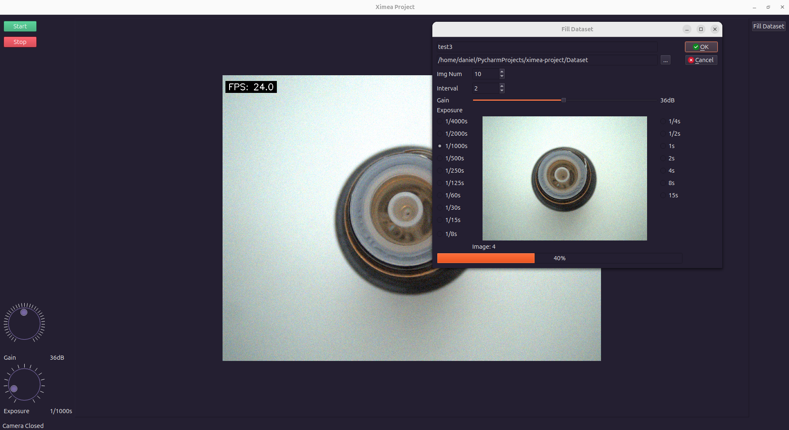

# XIMEA Project

## What will the application be used for:
- creating a dataset for image processing,
- learning using fast R-CNN
- object detection and inspection

## HW
- Camera MU050CR-SY by Ximea

## What APIs and frameworks will I use:
- ximea API
- PyQt6
- opencv
- torch