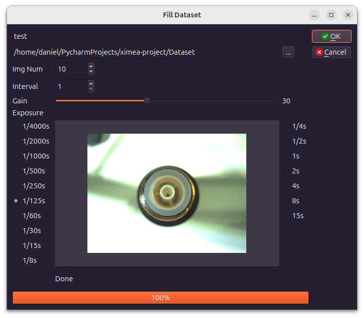
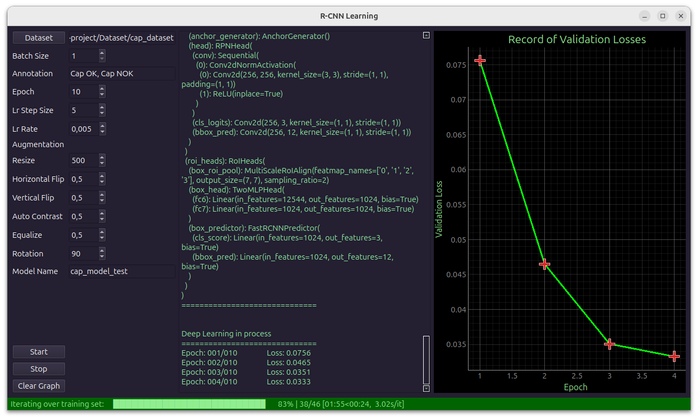
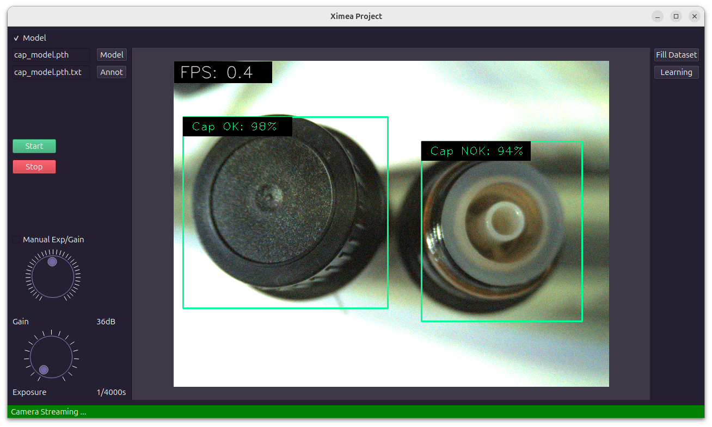

# XIMEA Project

Desktop GUI application for building an image dataset, training a Faster R-CNN model, and running object detection/inspection.

> This repository keeps the application code in `src/`. The `Dataset/` and `Models/` folders are runtime folders (kept as empty directories in git via `.gitkeep`).

## What is this app for?

This app is meant to support an end-to-end workflow:

1. **Capture / collect images** (e.g., from a Ximea camera)
2. **Annotate images** in an external labeling tool (Pascal VOC **XML**)
3. **Train** an object detector (Faster R-CNN)
4. **Run inference** (object detection + inspection) from the GUI

Screenshots:

- Dataset creation / filling:

  

- Training (learning) view:

  

- Main detection / inspection view:

  

## Hardware

- Camera: **Ximea MU050CR-SY**

## Tech stack

- Ximea camera API
- PyQt6 (GUI)
- OpenCV
- PyTorch / Torchvision (Faster R-CNN)
- `detecto` utilities (dataset helpers)

## Project structure

- `src/` — application source code (MVC-style split into `model/`, `view/`, `controller/`)
- `Dataset/` — runtime dataset folder (not versioned; only the folder exists in git)
  - expected: `Dataset/<dataset_name>/train/` and `Dataset/<dataset_name>/valid/`
- `Models/` — runtime trained models folder (not versioned; only the folder exists in git)
  - saved model weights: `Models/<model_name>.pth`
  - saved model classes/annotations: `Models/<model_name>.pth.txt`

## Dataset & annotations

- Images are typically `*.jpeg`.
- Annotations are expected as Pascal VOC **XML** files (`*.xml`) generated by your labeling tool.
- Folder layout (example):

  - `Dataset/cap_dataset/train/…` (images + xml)
  - `Dataset/cap_dataset/valid/…` (images + xml)

### Annotation labels

In the GUI you can enter multiple labels as a **comma-separated list**, for example:

- `Cap OK, Cap NOK`

Internally the app converts this into a Python list of classes. During training the app validates that labels in XML match the labels provided in the GUI.

## Installation

Create and activate a virtual environment, then install dependencies:

```bash
python -m venv .venv
source .venv/bin/activate
pip install -r requirements.txt
```

## Run

Start the GUI:

```bash
python src/main.py
```

## Training output

When training finishes, the app saves:

- `Models/<model_name>.pth` — model weights
- `Models/<model_name>.pth.txt` — a single line containing classes, e.g. `Cap OK, Cap NOK`

## Troubleshooting

- **Training stops with unknown label error**: your XML files contain a label that is not listed in the GUI annotation field. Add the missing label(s) in the GUI or fix the XML annotations.
- **Slow training**: training on CPU can be very slow. A CUDA-capable GPU is recommended.
- **Camera not found**: verify Ximea drivers/API installation and camera connection.

## License

See `LISENCE`.
